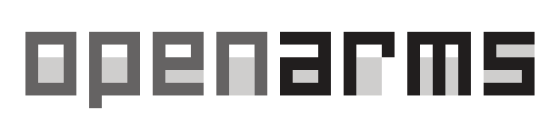

<p align="center">
  
</p>

### Opt-in verification before push / CI

Use `npm run test:pre-push -- --base <revision> --plan`, then the same command
without `--plan`. Replace `<revision>` with the reviewed base commit, such as
`origin/main`. Full Node tests run once plus classifier-required smoke. CI uses
`CI=true npm run test:pre-push -- --base <revision>` with enough Git history,
Docker Compose and Python/PTY when required. CI distrusts local smoke stamps;
missing capability blocks validation. No hook is installed automatically.
See [commands](docs/testing/testing.md) and [Sprint 0.4](docs/testing/how_to_test/Sprint_04.md).

OpenArms is a local verified-skill router and runtime-governance layer for
[OpenCode](https://github.com/anomalyco/opencode). It keeps skill content out of
the model context until a task needs it, stores selection per project/session,
and prevents unregistered skill files from bypassing the registry.

## Current Scope

- Intercepts `/skills` in the OpenCode TUI.
- Detects relevant packages from project files and dependencies.
- Loads only enabled packages through `load_skill_package`.
- Restricts skill paths to a registry-controlled local library.
- Uses atomic state updates and a per-task package lock.
- Bundles only skills with an explicit license. Each bundled skill retains its
  own license file.

OpenArms v2 will expand this foundation with usage telemetry, compact test
output, per-skill verified loading, budget warnings, and session lifecycle
controls. Enforcement remains opt-in until telemetry is reliable.

## Development

Requirements: Node.js 22 or newer.

```bash
npm ci
npm run test:plan
npm test -- --task task-123
```

`npm test` uses the unified runner to select syntax, related/full Node tests,
and required smoke boundaries from changed files. Use repeated `--file <path>`
for an explicit task scope or `--base <revision>` for committed changes.
`npm run test:full` explicitly requests the complete suite. Unknown paths return
`needs-review`. See [test policy and baseline collection](docs/testing/testing.md).

Checks return compact summaries and preserve raw output in `.openarms/logs/`.
Two identical failures on unchanged inputs block a third retry; after diagnosis,
use `--force --reason "<intentional rerun reason>"` to override. See the
[Sprint 0.1–0.3 report](docs/reports/sprints/report_sprint_01_02_03.md) for implementation evidence.

Install the dependencies, then reference the server entry point in your
OpenCode `opencode.json`:

```json
{
  "plugin": [
    "file:///absolute/path/to/OpenArms/plugins/skill-router-server.ts"
  ]
}
```

Register the TUI entry point separately in `tui.json` alongside that config:

```json
{
  "plugin": [
    "file:///absolute/path/to/OpenArms/plugins/skill-router-tui.tsx"
  ]
}
```

OpenArms writes runtime state to `$XDG_STATE_HOME/openarms/state.json`, falling
back to `~/.local/state/openarms/state.json`. This file is never part of the
repository.

## Architecture

Platform-independent core modules live in `src/`. The two entry points in
`plugins/` adapt OpenCode hooks and TUI events to that core. Both adapters use
`src/runtime.ts` to initialize the same registry, state paths, and package loader.
The previous core import paths remain available as compatibility facades.

See the [`docs` index](docs/README.md) for the user guide, runtime flow, state
model, security boundaries, onboarding, and architecture. The registry in this
checkout currently contains the `docs` package.

## Sandbox

Docker Compose provides isolated OpenCode config, state, databases, cache, and a
disposable project, pinned to the locally verified OpenCode version:

```bash
npm run test:plan
npm test
npm run sandbox -- start
```

The runner checks static contracts first, reuses fingerprinted pass results and
builds only when the required runtime image has no matching fingerprint label. Explicit
`npm run test:smoke` and `npm run test:tui-smoke` remain available for diagnostics;
do not run all sandbox checks for every edit. `npm run sandbox -- test` is a
low-level diagnostic command.

Use `npm run test:smoke-static` for offline contracts, or add `-- --force` to a
smoke command to rerun with a matching image; `-- --rebuild` also forces a build.
Runner-managed smoke uses temporary isolated volumes and cleans them after each
run. See [smoke contracts and cache](docs/testing/smoke-contract.md).

Add `--installed` to `start` or unified smoke commands to use the locally installed router's
registry and skill library read-only, with a separate set of sandbox volumes.
See [`sandbox/README.md`](sandbox/README.md) for authentication, fixtures, and reset.

The source repository intentionally excludes OpenCode runtime data, auth files,
databases, logs, backups, local state, and skills without verified licensing.

## OpenCode Fork

Compatibility work is tracked separately in
[`apase95/opencode`](https://github.com/apase95/opencode), a fork of the MIT
licensed upstream project. Keeping the fork separate allows OpenArms to remain
a focused plugin rather than a full OpenCode distribution.

## License

OpenArms engine code is released under the MIT License. Bundled skills are
distributed under the license contained in each skill directory.
